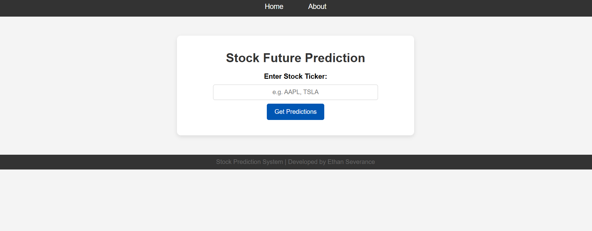
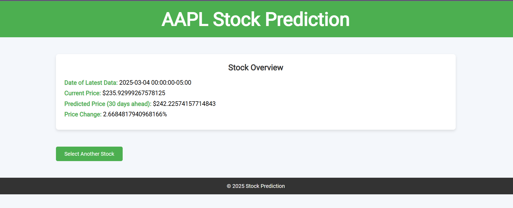
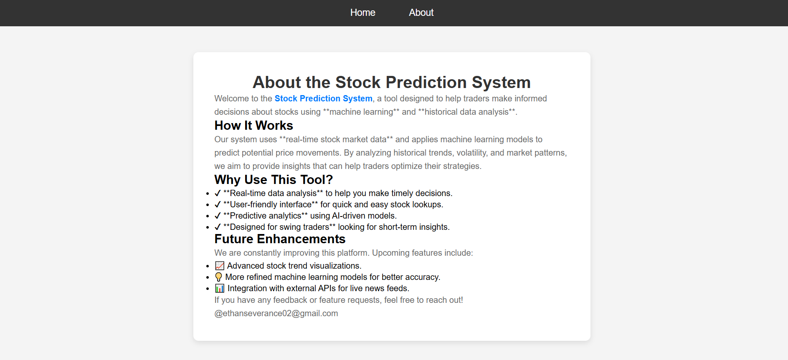

# **Stock Prediction Website**  
_A Machine Learning Model for 30-Day Stock Price Forecasting_  

## **Overview**  
This project uses machine learning to predict stock prices 30 days into the future based on historical data. The goal is to help traders and investors make informed decisions by providing data-driven forecasts. The website allows users to enter a stock ticker and receive a predicted price trend.  

## **Features**  
- Predicts stock prices 30 days into the future  
- Uses historical stock data for training  
- Interactive web interface for easy use  
- Built with Flask, MongoDB, and machine learning models  

## **Technologies Used**  
- **Python** (Pandas, NumPy, Scikit-Learn)  
- **Flask** (Backend Web Framework)  
- **MongoDB** (Database for storing stock data)  
- **HTML/CSS** (Frontend Design)  
- **Machine Learning Model** (Trained on historical stock prices)  

## Home Screen

## Results Screen

## About Page

